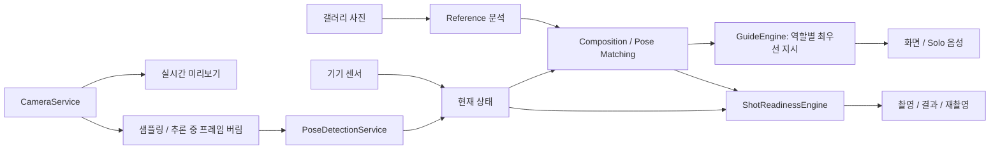

# 아키텍처

## 현재 경계

Flutter/Dart가 화면과 상태를 담당한다. Android를 먼저 생성하며 iOS 빌드는
현재 요구하지 않는다. 필요한 기능에 맞춰 feature-first로 파일을 추가하고,
미래 기능을 위한 빈 클래스나 폴더를 미리 늘리지 않는다.

Home → Reference 선택/미리보기 → Capture → Result 순서로 이동한다.
기본 Navigator와 위젯 상태로 충분한 동안 별도 라우팅·상태 관리 패키지는 넣지 않는다.
갤러리·카메라·파일 경로 등 플랫폼 기능은 `core/`에 두고,
UI 안에는 ML 계산을 넣지 않는다. 영속 저장은 앱 문서 영역을 사용한다.
앱 삭제 시 사진도 삭제되므로 결과 화면에서 저장 위치의 의미를 안내한다.

## 카메라와 AI 처리: 후속 단계 설계

미리보기 속도와 추론 속도를 분리한다. 초기 추론 목표는 5–15fps이고
기기 성능에 따라 조정한다. 추론 하나가 진행 중이면 다음 프레임을 버려
큐가 누적되지 않게 한다. 결과에 프레임 시각을 연결해 오래된 분석은 쓰지 않는다.
화면 회전, 센서 회전, 이미지 EXIF, 프리뷰 crop과 전면 미러링을 한 좌표계로 변환한다.
카메라를 백그라운드에서 해제하고 복귀 시 다시 초기화한다.

## 역할

| 역할 | 책임 |
| --- | --- |
| CameraService | 기기 선택, 권한 오류 전달, 초기화·해제, 촬영 |
| PoseDetectionService | 참조 이미지와 현재 프레임의 pose 추출 |
| CompositionMatchingService | 중심·박스·신장 비율·여백 차이 |
| PoseMatchingService | 신체 중심/크기 정규화와 관절각 비교 |
| GuideEngine | 촬영자/모델 역할, 우선순위, 짧은 메시지, 반복 억제 |
| ShotReadinessEngine | 검출·점수·흔들림·유지시간·촬영 중/대기 상태 |
| ReferenceRepository | 현재 로컬 사진, 이후 creator metadata와 검색 |
| 음성 어댑터 | Solo TTS, 시스템 Bluetooth 오디오 경로 |

위 ML·가이드 역할은 설계이며 첫 기본 카메라 단계에서 작동하는 척 구현하지 않는다.
재촬영은 명시적인 사용자 동작으로 다시 준비 상태에 들어가며,
자동촬영 이후 같은 조건으로 사진을 무한히 찍지 않도록 한다.

## 두 휴대폰 연결: Phase 12

촬영자 폰은 Camera Host, 모델 폰은 Viewer / Model Coach다.
저지연 preview, 촬영자와 구분한 모델 지시, 결과 preview, 만족/재촬영 요청을 전달한다.
세션 ID·프레임 시각·지시 대상·순서 정보를 넣고, 연결 끊김/재연결과 오래된 지시를 처리한다.
동일 Wi-Fi의 WebRTC, WebSocket, Android Nearby 등을 실기기 지연과 유지관리 기준으로
비교한 뒤 선택한다. 현재는 서버나 통신 의존성을 넣지 않는다.
모델이 준비되면 휴대폰을 내려놓고 카메라를 보게 안내하고, 이어폰 코칭으로 확장한다.

## 장기 서비스와 개인정보

주변 2–3초 스캔 → scene features/embedding → Reference 검색 → 재현 가능성 순 추천.
GPS는 보조 신호다. Creator metadata와 계정·팩·결제·정산은 시장 검증 후 분리한다.
이미지상 목표를 기본으로 하고 거리·카메라 높이는 optional metadata로 둔다.
촬영 전 focus/exposure 처리와 촬영 후 색감 보정은 별개 단계다.
기본 영상·얼굴·몸 분석은 온디바이스로 수행하며 자동 서버 업로드는 하지 않는다.
네트워크 공유와 향후 업로드에는 명확한 사용자 선택·동의를 둔다.
지원 여부가 없는 센서/검출 값을 0이나 만점으로 바꾸지 않고 unknown으로 표현한다.
